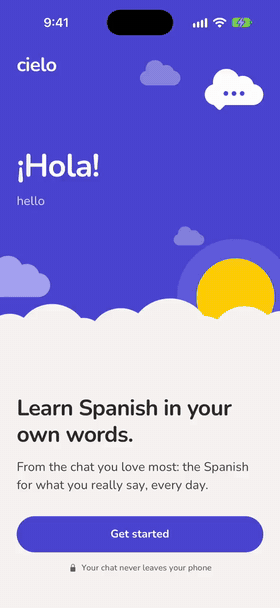
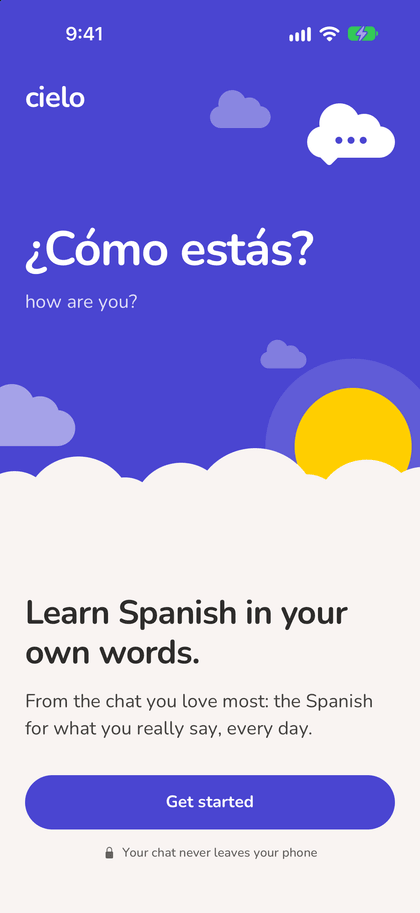
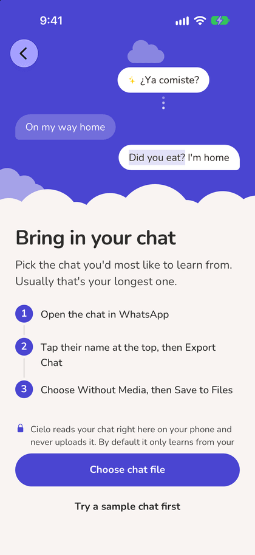
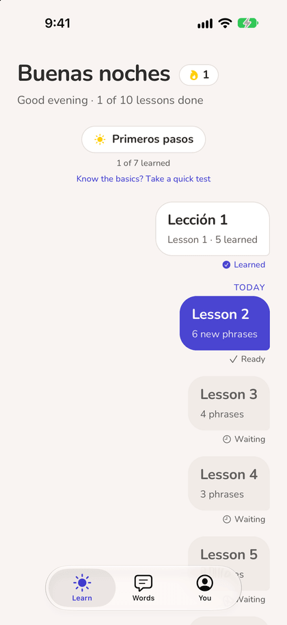
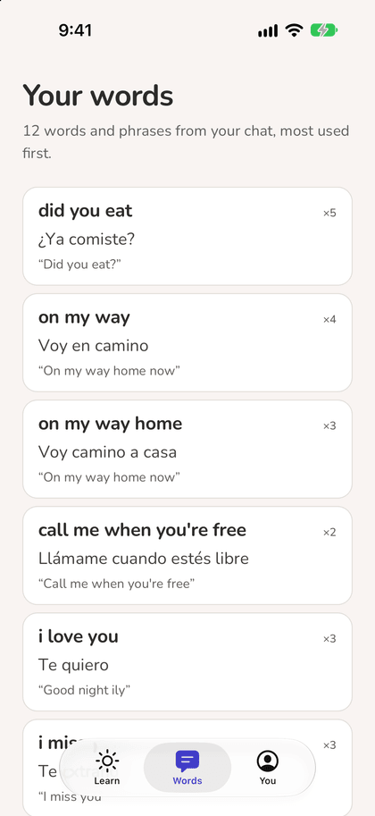
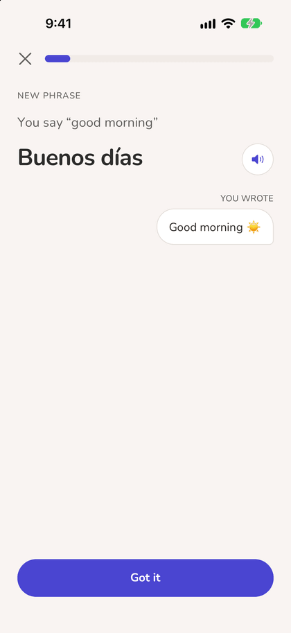
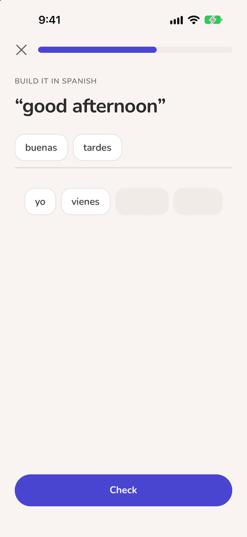
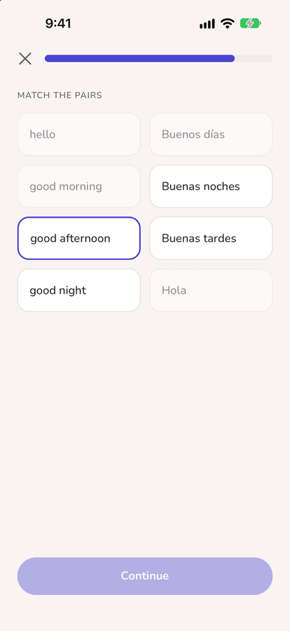
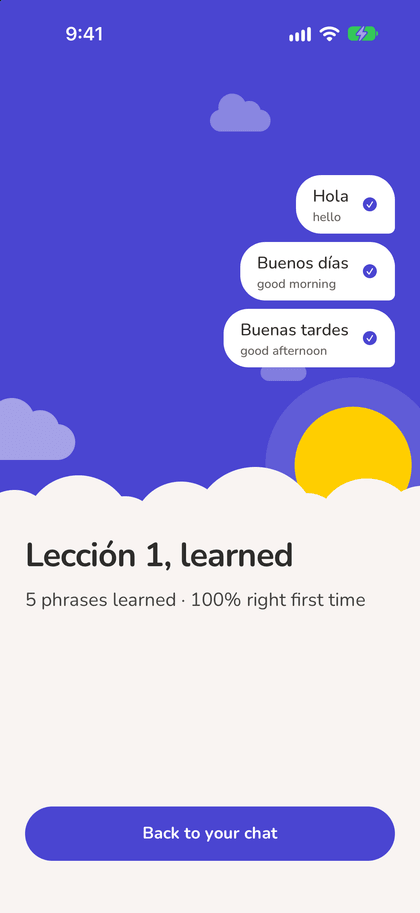

#  Cielo

**Learn Spanish in your own words.** Cielo reads the WhatsApp chat you have with your favourite person and teaches you the Spanish for the things *you* actually say: "did you eat?" becomes *¿Ya comiste?*, "on my way" becomes *Voy en camino*.

Most language apps teach everyone the same vocabulary. Cielo builds a personal course from your own conversations, and the chat never leaves your phone.

Built with React Native and Expo (iOS and Android), TypeScript, Expo Router, SQLite, Prisma, Neon Postgres and Better Auth.

<p align="center">
  
</p>

<p align="center"><a href="docs/media/demo.mp4">Watch the full demo video (43s)</a></p>

## Screenshots

| | | | |
|:-:|:-:|:-:|:-:|
|  |  |  |  |
| Welcome | Bring in your chat | Your path | Your words |
|  |  |  |  |
| Meet a phrase you wrote | Build it | Match the pairs | Lesson learned |

## How it works

```
WhatsApp export ─► parse ─► clean & repair spelling ─► rank your phrases ─► translate ─► build your path ─► lessons ─► spaced review
                   (all on the phone)
```

1. **Parse** ([`src/brain/parse-whatsapp.ts`](src/brain/parse-whatsapp.ts)): reads iOS (`.zip`) and Android (`.txt`) exports, both date orders, 12/24-hour clocks, multi-line messages, and skips system notices, deleted messages and media placeholders.
2. **Clean** ([`src/brain/normalize.ts`](src/brain/normalize.ts)): strips links, emails, phone numbers and @mentions, expands texting shorthand ("omw" → "on my way"), and detects names so they never become vocabulary.
3. **Repair spelling** ([`src/brain/spelling/`](src/brain/spelling/)): a self-contained module that fixes stretched words ("loooove" → "love") and typos ("tommorow" → "tomorrow") using the user's own spelling plus a 50,000-word frequency dictionary, while leaving names and deliberate slang alone.
4. **Rank** ([`src/brain/extract.ts`](src/brain/extract.ts)): counts words and phrases of up to six words, drops fragments and overlapping pieces, and scores what's left by how often *you* use it.
5. **Translate** ([`src/learning/phrase-bank/`](src/learning/phrase-bank/)): a hand-written bank of natural, casual Latin American Spanish, with gendered forms, Spain variants and short notes.
6. **Build the path** ([`src/learning/curriculum.ts`](src/learning/curriculum.ts)): "Primeros pasos", a short beginner day, then your phrases grouped by topic into small lessons, a few per day, each day ending in a recap. Beginners can skip the basics only by passing a short test.
7. **Teach** ([`src/learning/exercises.ts`](src/learning/exercises.ts), [`grading.ts`](src/learning/grading.ts)): meet, pick, build, match and type exercises. Missed answers come back at the end of the lesson; typing forgives missing accents and small typos but always shows the exact form.
8. **Review** ([`src/learning/review.ts`](src/learning/review.ts)): every phrase has an FSRS memory card, so it comes back just before you'd forget it, plus a gentle daily streak.

## Privacy by design

- The chat is parsed on the phone and stored only in the app's private storage.
- By default Cielo learns only from your own messages.
- The optional account backup holds the learning (phrases, finished lessons, memory cards, streak), never message text. The server rebuilds every upload from known fields only, so nothing else can ride along ([`src/sync/snapshot.ts`](src/sync/snapshot.ts)).

## Project structure

```
src/
  app/            screens and API routes (Expo Router)
    (onboarding)/ welcome, sign-in, import, "which one is you?"
    (tabs)/       learning map, words, profile
    lesson/       lessons, recaps, tests and reviews
    api/          auth, status and progress-backup endpoints
  brain/          chat parsing, cleaning, spelling repair, phrase ranking
  learning/       phrase bank, curriculum, exercises, grading, spaced review
  sync/           the backup format, shared by app and server
  lib/            on-device storage, sign-in, backup and practice tracking
  server/         database client and auth (server only)
  components/     the sky, the learning map, lesson screens, UI primitives
prisma/           database schema and migrations
scripts/          icon generator, Apple client-secret helper
```

## Running it

```bash
npm install
npx expo start
```

Open it in Expo Go, or press `i` for the iOS simulator. Sign-in and backup need a `.env` (see [`.env.example`](.env.example)); without one, development builds offer a "Skip sign-in" button.

```bash
npm test          # unit tests (node:test)
npx tsc --noEmit  # type check
npm run lint
npm run icons     # regenerate the app icon and splash from code
```

## Roadmap

- On-device translation for phrases the bank doesn't cover yet (Google ML Kit / Apple Translation)
- Opening exports straight from WhatsApp's share menu
- Development and store builds

## License

MIT
